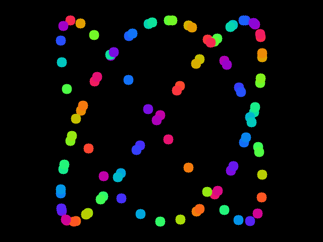

# artc

**artc** is a command-line tool for generating colorful, animated abstract artwork from Lua scripts. It renders visual scenes frame-by-frame and exports the result to `.mp4` or `.gif` format for easy sharing and reuse.

Ideal for generative art, live visuals, or just creative exploration through code.

---

## ✨ Features

- Write expressive animations using simple Lua scripts
- Render to high-quality video (`.mp4`) or looping GIFs
- Fully scriptable motion, color, shape, and timing
- Deterministic results with seeding support
- CLI interface for quick iteration and automation

## 🖋️ Example Script

Here's a sample Lua script that animates 100 color-shifting circles in a spiral motion:

```lua
window(640, 480)
bg("#000000")

local ids = {}

function setup()
    for i = 1, 100 do
        local id = circle({
            x = 0,
            y = 0,
            size = 10,
            color = "#000000",
            motion = "none",
            speed = 0,
            radius = 20
        })
        table.insert(ids, id)
    end
end

function update(dt)
    local t = time() * 0.001

    for i = 1, #ids do
        local offset = i * 0.2
        local x = 320 + math.sin(t + offset) * 200
        local y = 240 + math.cos(t + i * 0.3) * 200

        local r = 127 + math.sin(t + i)     * 127
        local g = 127 + math.sin(t + i + 2) * 127
        local b = 127 + math.sin(t + i + 4) * 127

        modify(ids[i], {
            x = x,
            y = y,
            color = hex({ r = r, g = g, b = b })
        })
    end
end
```



## 🚀 Usage

```sh
artc script.lua            # Render the script
artc script.lua -x         # Export animation to MP4 (default settings)
artc script.lua -x -F gif  # Export as GIF
```

## 🛠️ Installation

### From source

```sh
git clone https://github.com/yourname/artc.git
cd artc
make
sudo make install
```

#### Dependencies

- gcc
- SDL2
- FFmpeg

## 🧠 Scripting API

Your Lua script must define at least:

- `function setup()` – Called once before animation starts
- `function update(dt)` – Called each frame with time delta (in ms)

Check [artc.lua](./artc.lua) for the full list of available functions

## 🪪 License

[MIT](./LICENSE)

